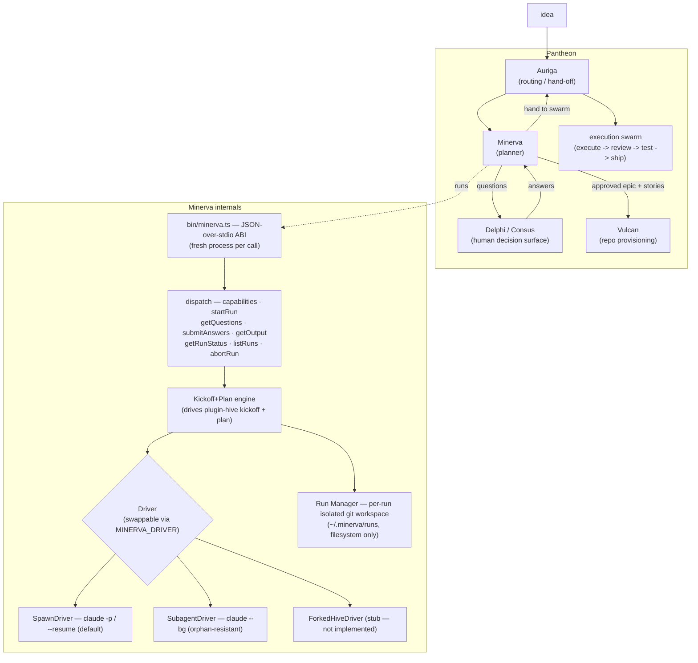

# Minerva

[](https://opensource.org/licenses/MIT)
[](https://opensource.org/)

**The Pantheon's Planner.** Minerva turns a raw **idea** into an **approved, planned spec** — an
epic with dependency-tracked stories — autonomously and headlessly.

[**Read the Documentation**](https://mdostal.github.io/minerva/)

Named for the Roman goddess of wisdom and strategic planning, Minerva runs the *front half* of
the hive flow (`kickoff` + `plan`), extracts the human-gate questions along the way, routes them
to the decision surface, iterates the back-and-forth, and emits the approved epic/stories — then
hands off to **Auriga** (routing) and **Vulcan** (provisioning) for the build.

## What & why

Planning used to mean a human hand-running `/hive:kickoff` and `/hive:plan` in a terminal, one
idea at a time. Minerva exists to make that step a **service you can drive from anywhere**: feed
it an idea over a stable subprocess ABI, and it drives plugin-hive's kickoff+plan skills against
an isolated per-run git workspace, surfaces exactly the questions that need answers, and returns
the finished spec.

Splitting the planner out of the terminal is what lets you **feed many ideas at once** — each idea
gets its own Minerva run and its own decision thread, in parallel, instead of a serial per-idea
terminal session. Auriga *routes and hands off* (it never plans). Vulcan *provisions repos*. The
decision surface is where a *human* answers. **Minerva is the engine that actually runs the
idea → plan loop.**

## Architecture



Minerva's **public interface is the Pantheon subprocess ABI** itself: a JSON-over-stdio,
`{method, params}` → `{result}` / `{error}` envelope, wire-compatible with plugin-hive's
task-tracking adapter ABI (v1.0.0). Every call is a fresh process; run state persists on the
filesystem under `~/.minerva/runs`. There is **no daemon** — nothing advances a run on its own;
a run only moves when a caller invokes `submitAnswers`.

## How it fits

- **Host:** [pantheon-v2](https://github.com/mdostal/pantheon-v2) is the core host that assembles
  the gods; Minerva is the planner slot.
- **Substrate:** Minerva is built on [plugin-hive](https://firefly-events.github.io/plugin-hive/)'s
  `kickoff` + `plan` skills, invoked programmatically, and speaks
  [Multica](https://github.com/firefly-events/multica)'s adapter-ABI wire format.
- **Sibling gods:** it receives routed ideas from **Auriga**, surfaces questions to the
  **Delphi / Consus** decision surface, and hands its approved epic/stories to **Vulcan**
  (provision) and back to **Auriga** (dispatch to the execution swarm).

## Quickstart

Minerva is a subprocess: one JSON request in on stdin, one JSON response out on stdout, exit `0`
on `result` / `1` on `error`. No server to start.

```bash
npm install

# Discover the ABI version
echo '{"method":"capabilities"}' | npx tsx bin/minerva.ts

# Start a run from an idea (returns a run_id)
echo '{"method":"startRun","params":{"idea":"add SSO to the billing app"}}' | npx tsx bin/minerva.ts

# Pull the pending questions for a run
echo '{"method":"getQuestions","params":{"run_id":"<run_id>"}}' | npx tsx bin/minerva.ts

# Answer them (this is the only write path that advances a run)
echo '{"method":"submitAnswers","params":{"run_id":"<run_id>","answers":[...]}}' | npx tsx bin/minerva.ts

# Fetch the approved epic + stories once the run is complete
echo '{"method":"getOutput","params":{"run_id":"<run_id>"}}' | npx tsx bin/minerva.ts
```

Other methods: `getRunStatus`, `listRuns`, `abortRun`. Useful env vars:

| Var | Purpose | Default |
| --- | --- | --- |
| `MINERVA_DRIVER` | Driver selection: `spawn` or `subagent` | `spawn` |
| `MINERVA_DRIVE_MODEL` | Model used to drive a turn | `claude-haiku-4-5-20251001` |
| `MINERVA_TURN_TIMEOUT_MS` | Per-turn ceiling | `600000` (10 min) |
| `MINERVA_HOME` | Run-state root | `~/.minerva` |

```bash
npm test          # tsx --test, TDD suite across src/ + bin/
npm run typecheck # tsc --noEmit
npm run ci        # test + typecheck (local CI — no GitHub Actions)
```

## Status

**Working (wip).** The subprocess ABI, the kickoff+plan engine, per-run isolated workspaces, and
the default `SpawnDriver` + opt-in orphan-resistant `SubagentDriver` are real and covered by a TDD
suite; `ForkedHiveDriver` is an intentional stub that throws until plugin-hive-fork exists. See
[VISION.md](./docs/vision.md) for the trajectory.

## Support

If you find this project helpful, consider supporting its development:
- [GitHub Sponsors](https://github.com/sponsors/mdostal)
- [Buy Me a Coffee](https://buymeacoffee.com/mdostal)

---

_Discipline: TypeScript default over the Pantheon subprocess ABI (interchangeable, any-language);
named → interfaced → full TDD → locked; local CI, no GitHub Actions._
