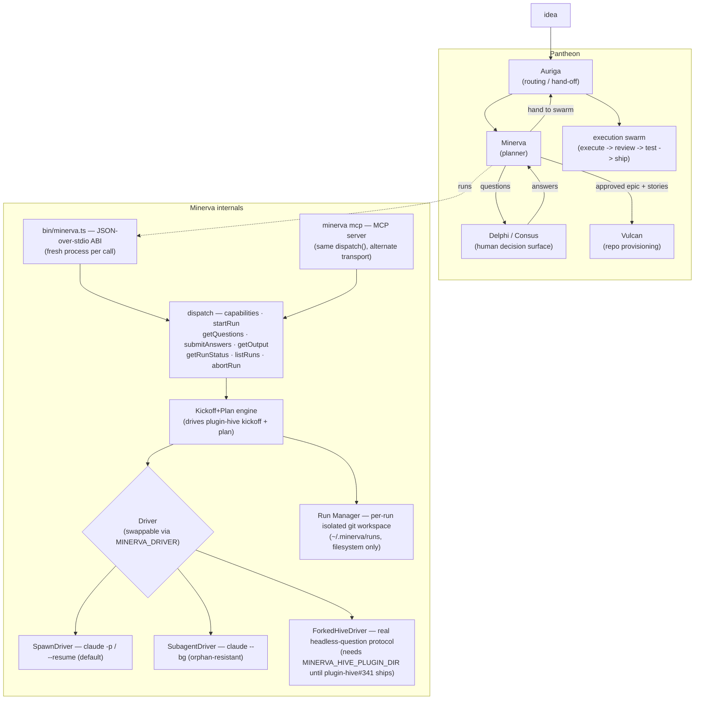

# Minerva

<!-- shared:tagline -->
> Turns an idea into a spec and a plan, headless. Free & open source.
<!-- /shared:tagline -->
<!-- shared:byline -->
Built by [Mathew Dostal](https://mdostal.com) — fractional CTO, Dostal Technology.
<!-- /shared:byline -->

**The Pantheon's Planner.** Minerva turns a raw **idea** into an **approved, planned spec** — an
epic with dependency-tracked stories — autonomously and headlessly.

Named for the Roman goddess of wisdom and strategic planning, Minerva runs the *front half* of
the hive flow (`kickoff` + `plan`), extracts the human-gate questions along the way, routes them
to the decision surface, iterates the back-and-forth, and emits the approved epic/stories — then
hands off to **Auriga** (routing) and **Vulcan** (provisioning) for the build.

## Get your agent using it in one command

```bash
curl -fsSL https://mdostal.github.io/minerva/install.sh | bash
```

Installs the CLI, wires the MCP server into whatever AI coding agent CLIs are already on the
machine (Claude Code, Codex CLI today), and drops in the `minerva-plan` usage skill — so an agent
gets the full startRun → poll → answer → repeat interaction pattern immediately, not just a raw
tool list. Already have Minerva installed? Just run `minerva agent init` — same thing, idempotent,
safe to re-run any time (e.g. after installing a new harness). `minerva agent status` shows what's
currently wired without changing anything. `--harness claude` / `--harness codex` narrows either
subcommand to just one harness.

Minerva has no UI of its own — this is the "top and forward" entry point for any agent or harness
that needs to drive it. No MCP-aware caller? Skip straight to the [Quickstart](#quickstart) below;
the identical 8 methods are also a plain JSON-over-stdio subprocess ABI.

## What & why

Planning used to mean a human hand-running `/hive:kickoff` and `/hive:plan` in a terminal, one
idea at a time. Minerva exists to make that step a **service you can drive from anywhere**: feed
it an idea over a stable subprocess ABI, and it drives plugin-hive's kickoff+plan skills against
an isolated per-run git workspace, surfaces exactly the questions that need answers, and returns
the finished spec.

Splitting the planner out of the terminal is what lets you **feed many ideas at once** — each idea
gets its own Minerva run and its own decision thread, in parallel, instead of a serial per-idea
terminal session. Auriga *routes and hands off* (it never plans). Vulcan *provisions repos*. The
decision surface is where a *human* answers. **Minerva is the engine that actually runs the
idea → plan loop.**

## Architecture



Minerva's **public interface is the Pantheon subprocess ABI** itself: a JSON-over-stdio,
`{method, params}` → `{result}` / `{error}` envelope, wire-compatible with plugin-hive's
task-tracking adapter ABI (v1.0.0). Every call is a fresh process; run state persists on the
filesystem under `~/.minerva/runs`. There is **no daemon** — nothing advances a run on its own;
a run only moves when a caller invokes `submitAnswers`.

## How it fits

- **Host:** [pantheon-v2](https://github.com/mdostal/pantheon-v2) is the core host that assembles
  the gods; Minerva is the planner slot.
- **Substrate:** Minerva is built on [plugin-hive](https://firefly-events.github.io/plugin-hive/)'s
  `kickoff` + `plan` skills, invoked programmatically, and speaks
  [Multica](https://github.com/firefly-events/multica)'s adapter-ABI wire format.
- **Sibling gods:** it receives routed ideas from **Auriga**, surfaces questions to the
  **Delphi / Consus** decision surface, and hands its approved epic/stories to **Vulcan**
  (provision) and back to **Auriga** (dispatch to the execution swarm).

## Quickstart

Minerva is a subprocess: one JSON request in on stdin, one JSON response out on stdout, exit `0`
on `result` / `1` on `error`. No server to start.

```bash
npm install

# Discover the ABI version
echo '{"method":"capabilities"}' | npx tsx bin/minerva.ts

# Start a run from an idea (returns a run_id)
echo '{"method":"startRun","params":{"idea":"add SSO to the billing app"}}' | npx tsx bin/minerva.ts

# Pull the pending questions for a run
echo '{"method":"getQuestions","params":{"run_id":"<run_id>"}}' | npx tsx bin/minerva.ts

# Answer them (this is the only write path that advances a run)
echo '{"method":"submitAnswers","params":{"run_id":"<run_id>","answers":[...]}}' | npx tsx bin/minerva.ts

# Fetch the approved epic + stories once the run is complete
echo '{"method":"getOutput","params":{"run_id":"<run_id>"}}' | npx tsx bin/minerva.ts
```

Prefer a native tool over hand-rolled subprocess calls? `npx tsx bin/minerva.ts mcp` runs the
identical 8 methods as an MCP server (stdio transport) — the same thing `minerva agent init`
registers automatically. See [Get your agent using it in one command](#get-your-agent-using-it-in-one-command)
above.

Other methods: `getRunStatus`, `listRuns`, `abortRun`. Useful env vars:

| Var | Purpose | Default |
| --- | --- | --- |
| `MINERVA_DRIVER` | Driver selection: `spawn` or `subagent` | `spawn` |
| `MINERVA_DRIVE_MODEL` | Model used to drive a turn | `claude-haiku-4-5-20251001` |
| `MINERVA_TURN_TIMEOUT_MS` | Per-turn ceiling | `600000` (10 min) |
| `MINERVA_HOME` | Run-state root | `~/.minerva` |

```bash
npm test          # tsx --test, TDD suite across src/ + bin/
npm run typecheck # tsc --noEmit
npm run ci        # test + typecheck (local CI — no GitHub Actions)
```

## Status

**Working (wip).** The subprocess ABI, the MCP server, the kickoff+plan engine, per-run isolated
workspaces, and all three drivers (`SpawnDriver`, `SubagentDriver`, `ForkedHiveDriver`) are real
and covered by a TDD suite. `ForkedHiveDriver`'s one open gap is external, not internal: its
production path needs `firefly-events/plugin-hive#341` (or its `hive-workshop` port) to actually
merge upstream — until then, set `MINERVA_HIVE_PLUGIN_DIR` at a local `plugin-hive-fork` checkout
to use `MINERVA_DRIVER=forked` (see `docs/decisions/002-pr341-production-dependency.md`). See
[VISION.md](./VISION.md) for the trajectory.

---

_Discipline: TypeScript default over the Pantheon subprocess ABI (interchangeable, any-language);
named → interfaced → full TDD → locked; local CI, no GitHub Actions._

<!-- shared:support -->
## Support this project

Free and open source, always. A few ways to help — or just say hi:

- **Use it, star it, file an issue.** Honestly the best support an open-source project can get. → [this project](https://github.com/mdostal/minerva)
- **Hire me.** I do fractional-CTO and consulting work — fixing and scaling tech stacks. → [mdostal.com/contact](https://mdostal.com/contact)
- **[Buy me a coffee](https://www.buymeacoffee.com/mdostal)** if it saved you time.
- **More tools like this** → [tools.mdostal.com](https://tools.mdostal.com)
- **Life outside the terminal** → [life.mdostal.com](https://life.mdostal.com)
- **What we're building at Firefly Events** — event discovery, 8,000+ events/day from 7+ sources → [ff.events](https://ff.events)

Always up for a conversation if any of it's useful to you.
<!-- /shared:support -->
