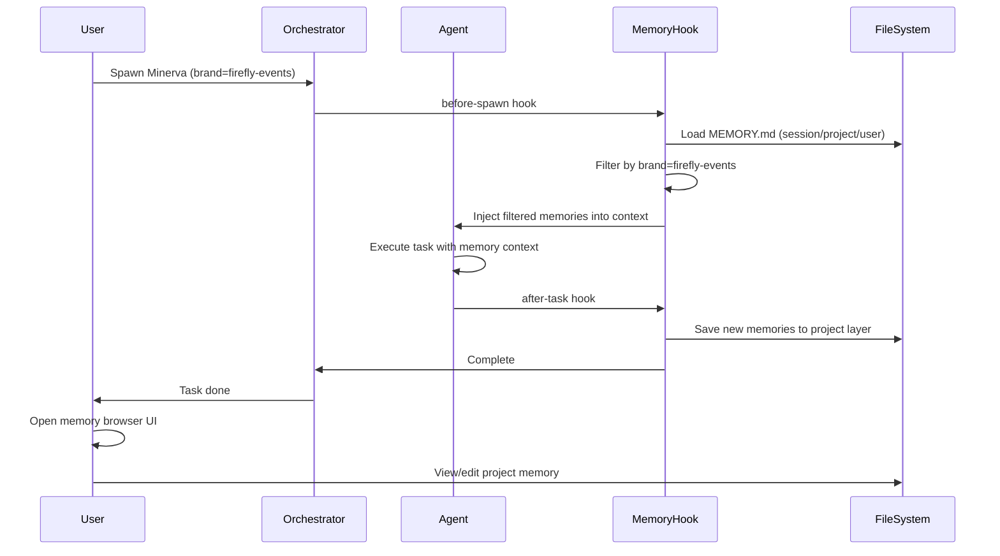

# PRD: Fully Active Memory System

## Summary

Build a phased, multi-backend memory system that starts with pre/post hooks wrapping Hive's existing file-based memory (extends Claude Code auto-memory + SQLite), then adds Qdrant semantic search, CodeGraph (tree-sitter AST/call graphs/dependencies), and document-section indexing. Phase 1 MVP: pre-hook loads memory (injected + tool-accessible), post-hook stores memory. Later phases: short-term/long-term memory split (PR-approval promotion), role-scoped memory (orchestrator/architect/dev), Sandman cleanup agent (nightly memory curation).

**Priority:** SUPER HIGH — immediately following end-to-end workflow completion. Critical for fixing context usage and enabling continuity (agents currently go "full amnesiac").

## Goals

1. **Persistence:** Agents maintain continuity of context across sessions without manual memory lookup
2. **Multi-backend:** Phase 1: file-based (Hive wrappers + SQLite); Phase 2+: Qdrant, CodeGraph, document sections
3. **Automatic:** Hooks trigger memory load on agent start and save on agent stop/task completion
4. **Inspectable:** Web UI for browsing, searching, and editing memory at each layer
5. **Granular:** Move beyond full-file context to line-range-scoped document sections (e.g., lines 100-120 of file X)
6. **Layered:** Different memory scopes for orchestrator (repo metadata), architect (full repo graph), dev (just impacted APIs)
7. **Temporal:** Short-term memory (in-progress work) vs. long-term memory (PR-approved facts)

## Non-Goals (Phase 1)

1. Qdrant/semantic search (deferred to Phase 2)
2. CodeGraph integration (deferred to Phase 2)
3. Real-time cross-session sync
4. AI-powered memory summarization (Sandman cleanup agent is Phase 2)
5. Full document-section indexing (deferred to Phase 2)

## Phase Strategy

- **Phase 1 (MVP):** Pre-hook to load memory (hybrid injection + tool-accessible), post-hook to store memory (file-based: Hive wrappers + SQLite). Auto-save on agent stop/completion. Memory injection: mix of direct context + on-demand tool lookup + bubble-up to orchestrator layers. Memory status: in-progress, reviewed, full-send.
- **Phase 2:** Add Qdrant semantic search + CodeGraph (tree-sitter AST, call graphs, dependency graphs via swarm-memory reference architecture) + document-section indexing (line ranges, not full files). CBA/comparison of CodeGraph systems required before implementation.
- **Phase 3:** Short-term/long-term memory split. Short-term: in-progress work, visible as high-level summaries to other agents. Long-term: only promoted when PR fully approved. Post-PR approval hook triggers promotion.
- **Phase 4:** Role-scoped memory layers (orchestrator: all repo metadata + skills + orchestration options; architect: full repo graph + metadata, not individual docs; dev: only necessary repo subset + impacted API contracts from graph, not full external codebases).
- **Phase 5:** Sandman cleanup agent (scheduled nightly memory curation — identifies duplicate/stale/low-value memories and archives/deletes).

## Users

- **Agent Developers:** Configure memory hooks and metadata for their agents
- **Pantheon Orchestrator:** Auto-load memory for spawned agents (Minerva, Hermes, etc.)
- **Human Operators:** Inspect, edit, and curate memory via web UI
- **Multi-Brand Users:** Need separated memory contexts for different brands/personas

## Requirements

### R1: Multi-Backend Memory Architecture (Phased)
- **R1.1 (Phase 1):** File-based memory via Hive wrappers (extends Claude Code auto-memory) + SQLite indexes. Starting point: Hive's existing wrappers around Claude's system.
- **R1.2 (Phase 2):** Qdrant semantic search backend for memory retrieval (reference: mdostal.com/blog/35-agent-ai-coding-swarm, prior ruvflow + Qdrant + hooks architecture).
- **R1.3 (Phase 2):** CodeGraph integration (tree-sitter AST, call graphs, dependency graphs). Reference architecture: https://github.com/mdostal/swarm-memory + https://www.falkordb.com/blog/code-graph/. Requires CBA/comparison of CodeGraph systems with options presented for approval in Consus console before implementation.
- **R1.4 (Phase 2):** Document-section indexing (store line ranges, not full files — e.g., "lines 100-120 of X"). Ticket-level indexes of applicable document sections. Hook feeds in direct sections, agent can look up additional sections via tool, bubble up context requests to other layers as needed.
- **R1.5 (Phase 3):** Short-term memory (in-progress work) vs. long-term memory (PR-approved, persisted). Only truly persistent after PR approval — short-term may not survive beyond merge.

### R2: Hook-Driven Lifecycle (Phase 1 MVP)
- **R2.1:** Before-hook: on agent spawn, load file-based memory. Injection strategy: mix of direct context injection + tool-based lookup (agent can request on-demand) + bubble-up to orchestrator layers as needed.
- **R2.2:** After-hook: on agent stop/task completion, auto-save new memories to appropriate layer. Also auto-save at interval checkpoints.
- **R2.3:** Hooks configured in `.claude/settings.json` or `.pHive/config/memory-hooks.json`
- **R2.4:** Memory status tracking: in-progress, reviewed, full-send (ready for promotion to long-term). Agents AWARE of status when bubbling context upstream.
- **R2.5:** Agent has tools to look up memory context as needed, not just passive injection

### R3: Brand/Persona Routing
- **R3.1:** Each memory record can have `metadata.brand` (e.g., "firefly-events", "dostal-tech", "pantheon")
- **R3.2:** Each memory record can have `metadata.persona` (e.g., "minerva", "hermes", "athena")
- **R3.3:** On memory load, filter records matching current agent's brand/persona (tag-based)
- **R3.4:** Default to loading untagged memories (no brand/persona metadata) for all agents

### R3a: Role-Scoped Memory (Phase 4)
- **R3a.1:** Orchestrator role: always loads metadata about all repos, skills, orchestration options (how to orchestrate, on/off toggles)
- **R3a.2:** Architect role: loads entire meta and code graph around the repo, but may not load individual docs
- **R3a.3:** Dev role: loads only necessary repo subset + what it knows from the graph about other codebases impacted by changes (knows they call their APIs, but doesn't know what those codebases are or do — just API contracts)

### R4: Memory Browser UI
- **R4.1:** Web UI accessible at `http://localhost:<port>/memory` when dev server running
- **R4.2:** Three-tab layout: Session | Project | User
- **R4.3:** Each tab shows MEMORY.md index with clickable links to individual memory files
- **R4.4:** Clicking a memory file shows rendered markdown with frontmatter metadata
- **R4.5:** Support basic search/filter by type, brand, persona
- **R4.6:** Inline edit capability (save writes back to file)

### R5: Short-Term vs. Long-Term Memory (Phase 3)
- **R5.1:** Short-term memory: captured during task execution, may not persist beyond PR merge
- **R5.2:** Long-term memory: only promoted when PR is fully approved and merged
- **R5.3:** Other agents may see high-level summaries of in-progress work (short-term), but not full detail
- **R5.4:** Post-PR approval hook: promote relevant short-term memories to long-term

### R6: Document-Section Granularity (Phase 2)
- **R6.1:** Index documents by line range (e.g., "lines 100-120 of CLAUDE.md apply to this ticket")
- **R6.2:** Pre-hook injects only relevant sections, not full files
- **R6.3:** Agent can request additional sections via tool call if context is insufficient
- **R6.4:** Bubble up context requests to upstream orchestrator layers as needed

### R7: Migration from Current Auto-Memory
- **R7.1:** Extend Claude Code's existing auto-memory system (`.claude/projects/.../memory/`) — do NOT fully replace in Phase 1. Hive wrappers + SQLite on top.
- **R7.2:** Hive's existing memory wrappers (SQLite extensions) are the starting point, but Claude's large file-based memory is inferior to prior ruvflow + Qdrant + hooks architecture (reference: mdostal.com/blog/35-agent-ai-coding-swarm).
- **R7.3:** Migration path: extend Claude's system in Phase 1, then improve/replace with Qdrant in Phase 2.
- **R7.4:** Migration script validates frontmatter and adds missing `metadata` fields
- **R7.5:** Preserve existing `name`, `description`, `type` fields

### R8: Performance
- **R8.1:** Memory load adds <500ms to agent startup
- **R8.2:** Support lazy-load: load MEMORY.md index first, then fetch individual files on-demand
- **R8.3:** Cache loaded memories in-memory for session duration

### R9: Sandman Cleanup Agent (Phase 5)
- **R9.1:** Specialized scheduled agent named "Sandman" runs nightly to curate and prune stale memories ("cleans memories at night")
- **R9.2:** Post-hook handles immediate memory writes; Sandman handles long-term cleanup (mixed responsibility model)
- **R9.3:** Sandman identifies duplicate, outdated, or low-value memories and archives or deletes them
- **R9.4:** Sandman is a separate specialized agent, not just a post-hook extension

## Acceptance Criteria (Phase 1 MVP)

1. Pre-hook successfully loads file-based memory and injects into agent context on spawn
2. Post-hook auto-saves new memories after agent stop/task completion
3. Memory injection is a mix: some direct context, some tool-accessible lookups
4. Memory status tracking works (in-progress, reviewed, full-send)
5. Agent startup latency increases by <500ms with memory auto-load enabled
6. Existing Hive + Claude Code auto-memory files integrate without data loss

## Acceptance Criteria (Phase 2+)

1. Qdrant semantic search backend retrieves relevant memories by embedding similarity
2. CodeGraph integration provides AST/call-graph/dependency-graph context
3. Document-section indexing returns line-range-scoped context (e.g., lines 100-120 of X)
4. Short-term/long-term memory separation works; PR approval promotes memories
5. Role-scoped memory routing: orchestrator sees all repo metadata, dev sees only impacted APIs
6. Sandman cleanup agent runs nightly and prunes stale/duplicate memories

## User Flow

## Priority

**SUPER HIGH** — This work needs to follow end-to-end workflow completion and immediately fix context usage / knowledge retention issues. Agents are currently going "full amnesiac" between sessions, which blocks effective continuation of work.

## Risks

### Risk 1: Latency Impact
**Mitigation:** Implement lazy-load (index only); cache in-memory; provide opt-out flag

### Risk 2: Memory Bloat
**Mitigation:** Phase 5 Sandman cleanup agent; cap memory file size; archival tooling

### Risk 3: Brand/Persona Routing Complexity
**Mitigation:** Start simple (tag-based filtering); defer advanced routing to Phase 4

### Risk 4: Migration Failures
**Mitigation:** Dry-run migration script; backup existing memory before migration; validation checks

### Risk 5: Hook Configuration Fragility
**Mitigation:** Provide default hooks in `.pHive/config/`; clear error messages; fallback to manual load

### Risk 6: Memory Layer Confusion (session/project/user vs. orchestrator/architect/dev)
**Mitigation:** Phase 1: focus on file-based layers (session/project/user). Phase 4: introduce role-scoped memory (orchestrator/architect/dev). Do NOT conflate the two concepts — memory layers are the storage backend, role-scoped is the access pattern.

### Risk 6: CodeGraph Research Needed
**Mitigation:** Phase 2 includes deep CBA (Cost-Benefit Analysis) and comparison of CodeGraph vs. alternatives (FalkorDB, swarm-memory). User expects detailed breakdown in Consus console for approval before choosing solution.

### Risk 7: Large File Context Inefficiency
**Mitigation:** Claude Code's current full-file memory loading is inefficient; Phase 2 document-section indexing addresses this by loading only relevant line ranges.
