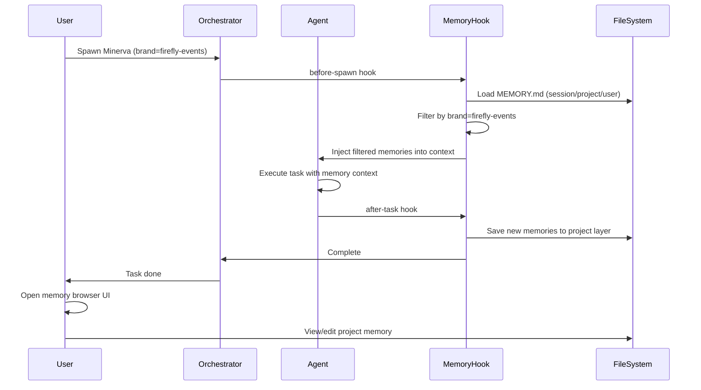

# PRD: Fully Active Memory System

## Summary

Build a multi-layer, hook-driven memory system that ensures Pantheon agents consistently load, consult, and update persistent memory records across sessions. The system will provide automatic memory lifecycle management, brand/persona-specific routing, and a web UI for inspecting and managing memory at each layer.

## Goals

1. **Persistence:** Agents maintain continuity of context across sessions without manual memory lookup
2. **Multi-layer:** Support session (ephemeral), project (`.pHive/memory/`), and user (`~/.claude/memory/`) memory tiers
3. **Automatic:** Hooks trigger memory load on agent start and save on agent stop/task completion
4. **Inspectable:** Web UI for browsing, searching, and editing memory at each layer
5. **Routed:** Brand/persona metadata ensures the right agent gets the right memory (e.g., Firefly Events vs dostal tech)

## Non-Goals

1. Database-backed storage (file-based only for now)
2. Real-time cross-session sync
3. Code graph generation (separate future epic)
4. AI-powered memory summarization/deduplication
5. Memory versioning beyond git

## Users

- **Agent Developers:** Configure memory hooks and metadata for their agents
- **Pantheon Orchestrator:** Auto-load memory for spawned agents (Minerva, Hermes, etc.)
- **Human Operators:** Inspect, edit, and curate memory via web UI
- **Multi-Brand Users:** Need separated memory contexts for different brands/personas

## Requirements

### R1: Multi-Layer Memory Structure
- **R1.1:** Session memory lives in `.pHive/sessions/<session-id>/memory/`
- **R1.2:** Project memory lives in `.pHive/memory/` (shared across sessions for this project)
- **R1.3:** User memory lives in `~/.claude/memory/` (shared across all projects)
- **R1.4:** Each layer has a `MEMORY.md` index file + individual `*.md` memory files
- **R1.5:** Memory files use frontmatter: `name`, `description`, `type`, `metadata.brand`, `metadata.persona`

### R2: Hook-Driven Lifecycle
- **R2.1:** Before-hook: on agent spawn, load `MEMORY.md` from all layers and filter by brand/persona
- **R2.2:** After-hook: on agent stop/task completion, auto-save new memories to appropriate layer
- **R2.3:** Hooks configured in `.claude/settings.json` or `.pHive/config/memory-hooks.json`
- **R2.4:** Support explicit save points via tool call (e.g., `MemorySave`)

### R3: Brand/Persona Routing
- **R3.1:** Each memory record can have `metadata.brand` (e.g., "firefly-events", "dostal-tech", "pantheon")
- **R3.2:** Each memory record can have `metadata.persona` (e.g., "minerva", "hermes", "athena")
- **R3.3:** On memory load, filter records matching current agent's brand/persona
- **R3.4:** Default to loading untagged memories (no brand/persona metadata) for all agents

### R4: Memory Browser UI
- **R4.1:** Web UI accessible at `http://localhost:<port>/memory` when dev server running
- **R4.2:** Three-tab layout: Session | Project | User
- **R4.3:** Each tab shows MEMORY.md index with clickable links to individual memory files
- **R4.4:** Clicking a memory file shows rendered markdown with frontmatter metadata
- **R4.5:** Support basic search/filter by type, brand, persona
- **R4.6:** Inline edit capability (save writes back to file)

### R5: Migration from Current Auto-Memory
- **R5.1:** Existing `.claude/projects/.../memory/` files auto-migrate to `.pHive/memory/`
- **R5.2:** Migration script validates frontmatter and adds missing `metadata` fields
- **R5.3:** Preserve existing `name`, `description`, `type` fields

### R6: Performance
- **R6.1:** Memory load adds <500ms to agent startup
- **R6.2:** Support lazy-load: load MEMORY.md index first, then fetch individual files on-demand
- **R6.3:** Cache loaded memories in-memory for session duration

## Acceptance Criteria

1. A Minerva agent spawned with brand="firefly-events" only sees Firefly-tagged + untagged memories
2. When an agent completes a task, new memories are auto-saved to the appropriate layer (session vs project vs user)
3. The memory browser UI correctly displays all three layers with working search/filter
4. Existing auto-memory files migrate without data loss
5. Agent startup latency increases by <500ms with memory auto-load enabled

## User Flow

## Risks

### Risk 1: Latency Impact
**Mitigation:** Implement lazy-load (index only); cache in-memory; provide opt-out flag

### Risk 2: Memory Bloat
**Mitigation:** Cap memory file size; provide archival/cleanup tooling; regular audits

### Risk 3: Brand/Persona Routing Complexity
**Mitigation:** Start simple (tag-based filtering); defer advanced routing to Phase 2

### Risk 4: Migration Failures
**Mitigation:** Dry-run migration script; backup existing memory before migration; validation checks

### Risk 5: Hook Configuration Fragility
**Mitigation:** Provide default hooks in `.pHive/config/`; clear error messages; fallback to manual load
