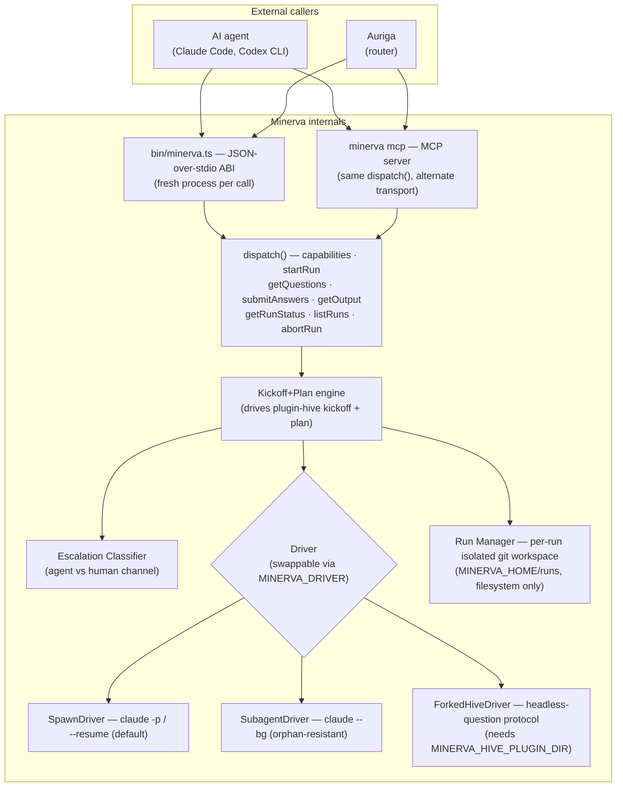

# Architecture

Minerva's design is deliberately narrow: a stateless subprocess ABI with swappable drivers,
filesystem-only persistence, and no daemon. This page documents the internals.

## System diagram



## Components

### CLI / subprocess entrypoint (`bin/minerva.ts`)

The single executable. Reads one `{method, params}` envelope from stdin per invocation,
dispatches, writes one `{result}`/`{error}` envelope to stdout, exits.

**Fresh process per call** — this is the entire external surface. There is no daemon.

### MCP server (`minerva mcp`)

The same `dispatch()` call behind a different transport. Exposes all 8 methods as MCP tools via
`@modelcontextprotocol/sdk`'s stdio transport. Not a separate implementation — identical result
and error contract as the subprocess ABI.

Also ephemeral: a stdio-piped child process per connection, not a persistent listener.

### Dispatch (`src/dispatch.ts`)

The method router. Maps incoming `{method, params}` to the correct handler, validates `run_id`
UUID shape at the ABI boundary before any handler is invoked, and wraps all handler errors into
the closed error-code envelope.

### Run Manager (`src/run-manager.ts`)

Owns run lifecycle:

- `startRun` allocates a `run_id`, creates an isolated workspace, and writes initial run metadata
- All subsequent calls look up the run's paths by `run_id`
- All state lives under `MINERVA_HOME/runs/<run_id>/`

#### Workspace kinds

| Case | Workspace |
|------|-----------|
| `target_repo` provided | Git **worktree** cut from that repo's `dev` branch |
| `target_repo` absent (greenfield) | Git **worktree** cut from a resolved repo: a `MINERVA_REPO_MAP` god repo, `MINERVA_INCUBATOR_REPO`, or the seed repo (`MINERVA_SEED_REPO`, default `~/repos/consus-seeds`) |

Either way, plugin-hive's `.pHive/` always lives inside a valid git repo.

### Kickoff+Plan Engine (`src/kickoff-engine.ts`)

Wraps plugin-hive's `kickoff` + `plan` skills, running them headlessly per run. Drives the
question-extraction and classification loop, applies pre-baked defaults, and calls `submitAnswers`
to advance the run when a question resolves.

Key invariant: **nothing advances a run except an explicit `submitAnswers` call.** `in_progress`
between calls means paused, not working. Inside a `startRun` or `submitAnswers` call, routine gate
questions are auto-answered in-process from the run's plan defaults (up to `max_auto_answers`,
default `40`); nothing runs between calls.

### Escalation Classifier

For each extracted question, emits a structured suggestion:

```json
{
  "suggested_channel": "human",
  "confidence": 0.92,
  "reason": "Strategic, irreversible scope decision"
}
```

The classifier does **not** own the enforced channel — it classifies and defers. In v1 the
enforced `channel` defaults to `suggested_channel`; in v2 Delphi's policy layer (Vesta) will
override it.

**Routing principle:** escalate if the question is strategic, ambiguous, irreversible, or
low-confidence. Absorb if it is routine, mechanical, or pre-decided.

### Driver abstraction (`src/driver.ts`)

The mechanism that actually drives a headless turn is a swappable `Driver` interface. Three
implementations, selected via `MINERVA_DRIVER`:

#### SpawnDriver (default)

```bash
MINERVA_DRIVER=spawn  # or unset
```

Drives each turn via `claude -p` / `--resume`. Real SIGINT/SIGTERM hardening kills any
in-flight child before the process exits.

#### SubagentDriver (orphan-resistant)

```bash
MINERVA_DRIVER=subagent
```

Dispatches each turn via `claude --bg`, polled through `claude agents --json` until terminal,
then extracted via `--resume --json-schema`. Survives its launching process being SIGKILL'd —
the only driver that closes the orphaned-subprocess failure mode.

#### ForkedHiveDriver (experimental)

```bash
MINERVA_DRIVER=forked
MINERVA_HIVE_PLUGIN_DIR=/path/to/plugin-hive-fork  # required until plugin-hive#341 merges
```

Drives plugin-hive's real structured headless-question protocol instead of prose-scraping. No
live process runs while a question sits unanswered — the protocol hands off via a file
(`.pHive/questions/*.yaml`). This is the intended fix for the orphaning risk.

!!! warning "Production dependency"
    `ForkedHiveDriver`'s production path requires `firefly-events/plugin-hive#341` (or
    `firefly-events/hive-workshop#127`) to merge. Until then, set `MINERVA_HIVE_PLUGIN_DIR` at
    a local `plugin-hive-fork` checkout to use this driver. See
    `docs/decisions/002-pr341-production-dependency.md`.

### State store

Plain files under `MINERVA_HOME/runs/<run_id>/.pHive/`:

| File | Contents |
|------|----------|
| Run metadata | `run_id`, `status`, `created_at`, `idea`, workspace paths |
| Question queue | Pending/answered questions with their classification |
| Output | Approved epic + stories (once `complete`) |

No in-memory state survives between CLI invocations — everything for the next call is read from
disk. This is also what makes pause/resume free: a held run is just a run whose on-disk state
hasn't been advanced yet.

### Cleanup ledger

On run completion or `abortRun`, Minerva appends a `CleanupLedgerRecord` to a shared,
append-only log at `MINERVA_HOME/cleanup-ledger.jsonl` and emits a `cleanup_needed` event.

**Minerva never deletes a workspace.** Deletion is an external GC's responsibility.

## No daemon

There is no daemon, no background polling, no autonomous progress. A run only moves when a
caller invokes `submitAnswers`. `getRunStatus: in_progress` between calls does not mean work is
happening — it means the run is paused, awaiting the next drive call.

## Design decisions

### AD-1 — Fresh subprocess per call, no daemon

Reuses plugin-hive's adapter ABI wire format directly — same envelope, same statelessness
discipline. A long-lived local HTTP/RPC server was considered and rejected: it adds a persistent
process to install/monitor/restart, fighting the "any-language, interchangeable" property.

### AD-2 — Escalation classifier emits; external policy decides

The classifier emits `{suggested_channel, confidence, reason}` and defers. An external policy
layer (Vesta in v2) owns the enforced channel. This keeps approval policy in the Pantheon layer,
not inside a plugin.

### AD-3 — Two workspace kinds, not one

"Worktree per run" as a universal rule breaks for greenfield ideas (no parent repo). Two cases
selected by whether `target_repo` is present: worktree for existing repos, fresh `git init` for
greenfield. Either way, plugin-hive's assumption that `.pHive/` lives inside a valid git repo
holds.

*Update:* the code no longer uses `git init`. Greenfield runs also get a worktree, cut from a
resolved repo (see [Workspace kinds](#workspace-kinds)), so a finished plan can be committed and
pushed somewhere a build agent can reach it.

### AD-4 — Record + emit on completion, never auto-delete

The cleanup ledger + `cleanup_needed` event let an external GC gather and act; without them, GC
has no reliable signal for when a run closed. TTL-based auto-GC deferred to v2.

### AD-5 — No stall timeout; hold is unbounded

`waiting_on_human` holds indefinitely. Timeout-then-default-answer was rejected outright — it
directly violates the hard exclusion against auto-approving or guessing a human decision.
Resuming after an arbitrary gap reuses the same resume-from-disk mechanism every call already uses.
