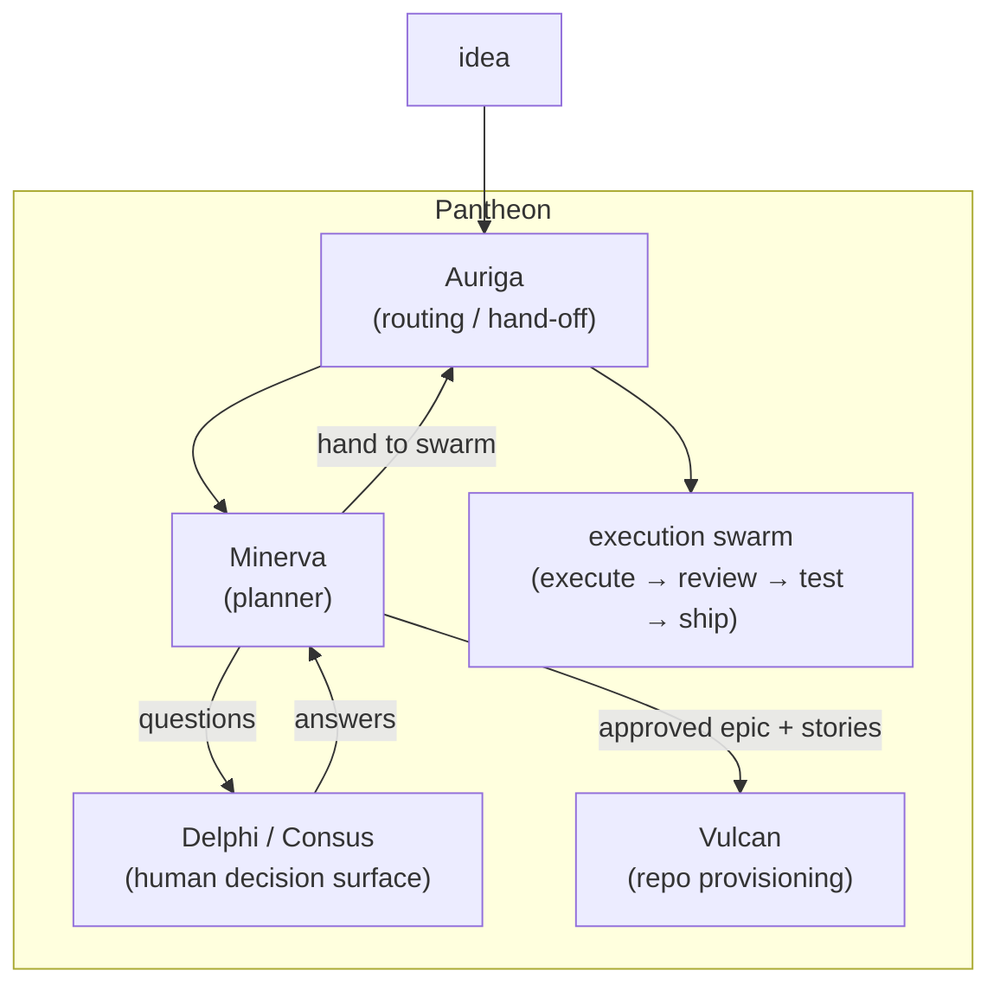

# What is Minerva?


> Turns an idea into a spec and a plan, headless. Free & open source.

**The Pantheon's Planner.** Minerva turns a raw **idea** into an **approved, planned spec** — an
epic with dependency-tracked stories — autonomously and headlessly.

Named for the Roman goddess of wisdom and strategic planning, Minerva runs the *front half* of
the hive flow (`kickoff` + `plan`), extracts the human-gate questions along the way, routes them
to the decision surface, iterates the back-and-forth, and emits the approved epic/stories — then
hands off to **Auriga** (routing) and **Vulcan** (provisioning) for the build.

## Get your agent using it in one command

```bash
curl -fsSL https://mdostal.github.io/minerva/install.sh | bash
```

This installs the CLI, wires the MCP server into whatever AI coding agent CLIs are already on the
machine (Claude Code, Codex CLI today), and drops in the `minerva-plan` usage skill — so an agent
gets the full `startRun → poll → answer → repeat` interaction pattern immediately, not just a raw
tool list.

Already have Minerva installed? Just run `minerva agent init` — same thing, idempotent, safe to
re-run any time (e.g. after installing a new harness). `minerva agent status` shows what's
currently wired without changing anything.

No MCP-aware caller? Skip straight to the [Quickstart](quickstart.md); the identical 8 methods
are also a plain JSON-over-stdio subprocess ABI.

## How it works

Minerva's **public interface is a subprocess ABI**: a JSON-over-stdio, `{method, params}` →
`{result}` / `{error}` envelope. Every call is a fresh process; run state persists on the
filesystem under `~/.minerva/runs`.

There is **no daemon** — nothing advances a run on its own. A run only moves when a caller
invokes [`submitAnswers`](abi-reference.md#submitanswers).



## Where Minerva fits

| Component | Role |
|-----------|------|
| **Auriga** | Routes ideas, hands off to Minerva; dispatches to the execution swarm |
| **Minerva** | Runs the kickoff+plan loop, surfaces questions, emits approved specs |
| **Delphi / Consus** | Human decision surface — receives questions, sends answers |
| **Vulcan** | Provisions repos from the approved spec |

## Quick links

- [Quickstart](quickstart.md) — get running in 5 minutes
- [ABI Reference](abi-reference.md) — all 8 methods documented
- [MCP Server](mcp-server.md) — drive Minerva from Claude Code or Codex CLI
- [Architecture](architecture.md) — internals and design decisions
- [Configuration](configuration.md) — env vars and plan defaults
- [Vision & Roadmap](vision.md) — where Minerva is going
